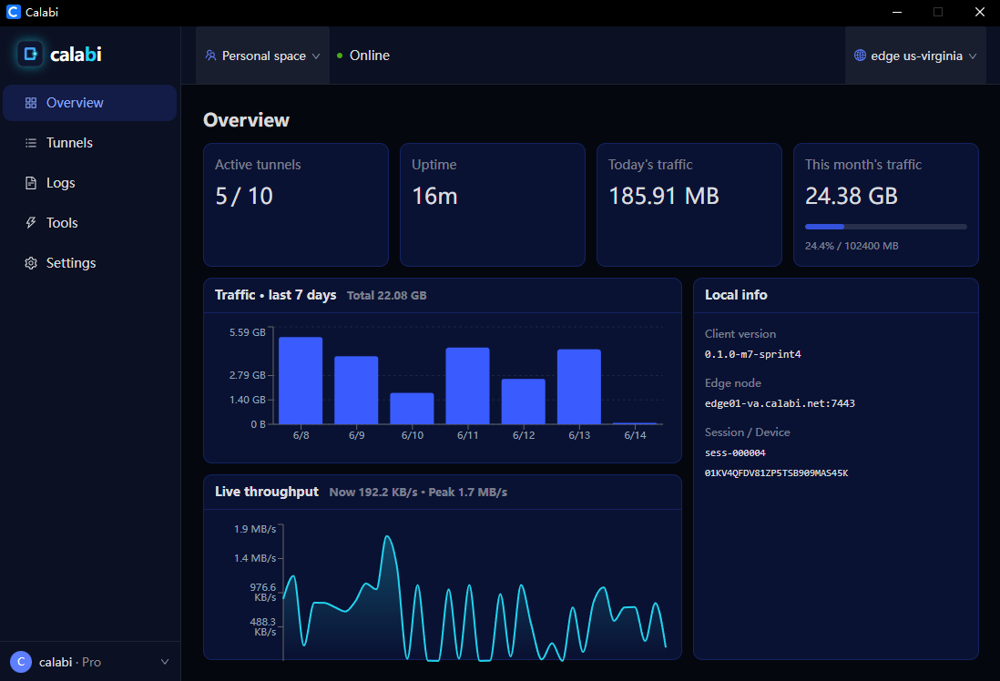

# Calabi — tunnels + mesh, self-hostable

Calabi is a self-hostable tunneling tool: run an edge (`calabi-edge`) on a host
with a public IP, and the `calabi` client forwards that public traffic to
services on your laptop or LAN — over a single outbound TLS + yamux connection,
with no account and no phone-home. Everything you need to run it yourself is in
this repository.

```
┌─────────────┐        TLS + yamux        ┌──────────────┐      your app
│  calabi     │ ────────────────────────► │  calabi-edge │ ───►  127.0.0.1:8080
│  (client)   │   control + data streams  │  (your VPS)  │
└─────────────┘                           └──────────────┘
   your laptop                            public IP / DNS        visitors ──┘
```

## Features

- **HTTP, HTTPS, TCP, and UDP tunnels** — expose web apps, SSH, databases, game
  servers, or anything else that speaks TCP/UDP.
- **One multiplexed connection** — the client keeps a single outbound TLS + yamux
  session to the edge, so there are no inbound ports to open on your machine.
- **Custom domains + HTTPS** — map a tunnel to `app.example.com` by pointing DNS
  at your edge, which can also terminate HTTPS.
- **Per-tunnel access control** — IP allow/deny lists on any tunnel, and HTTP
  Basic auth on web tunnels (passwords are bcrypt-hashed locally before they ever
  leave your machine).
- **Supervisor daemon** — run all your tunnels from one YAML file in a single
  process with automatic reconnect, and install it as a boot-start OS service
  (Windows service / systemd / launchd) that restarts on crash.
- **Built-in web console** (`http://127.0.0.1:7400`) — a live tunnel list with
  traffic counters, a request inspector with one-click replay, daemon logs, and
  create / edit / delete tunnels straight from the browser. Available in 10
  languages.
- **Self-contained** — no account, no callbacks, no telemetry; it runs entirely
  on infrastructure you own.
- **Two small static binaries** — `calabi` and `calabi-edge`, pure Go with no
  runtime dependencies; drop them on a VPS, a container, or a Raspberry Pi.

## The local console

`calabi daemon` serves a built-in web console at `http://127.0.0.1:7400` — watch
your tunnels, live throughput, and per-request detail locally, with no external
dashboard and no account. The UI ships in 10 languages.

<p align="center">
  <br>
  <em>Overview — active tunnels, 7-day traffic, and live throughput</em>
</p>

## Build

Requires Go 1.25+.

```bash
make build          # → bin/calabi, bin/calabi-edge, bin/calabi-coord
```

Or directly (on Windows, name the outputs `*.exe`):

```bash
( cd apps/client       && go build -o calabi       ./cmd/calabi )
( cd apps/calabi-edge  && go build -o calabi-edge  ./cmd/calabi-edge )
( cd apps/calabi-coord && go build -o calabi-coord ./cmd/calabi-coord )
```

Three binaries: **`calabi`** connects, **`calabi-edge`** is the entry point or
relay depending on its role, **`calabi-coord`** coordinates a mesh.

`make build` already adds the `.exe` suffix automatically on Windows. To
cross-compile (e.g. a Windows binary from a Linux box):
`GOOS=windows GOARCH=amd64 go build -o calabi-edge.exe ./cmd/calabi-edge`.

## Verify the binaries you downloaded

The point of publishing this source is that you do not have to take our word for
what is in the binaries. **The official releases are built from this repository**,
not from an internal tree, and each release ships a manifest naming the exact
commit, toolchain and flags. Rebuild them yourself:

```bash
curl -fsSLO https://download.calabi.net/latest/build-manifest.json
make verify-build MANIFEST=build-manifest.json
```

That rebuilds every released binary and compares hashes. It needs the same Go
version the manifest names; a different one is the usual reason a check fails,
and the script says so up front.

It compares the **binary**, not the `.zip`/`.tar.gz` you downloaded, because
archives are not reproducible — tar+gzip and zip both record modification times,
so the same bytes packaged a second later hash differently. Use `SHA256SUMS` for
the archive: that answers "did my download arrive intact", which is a different
question from "was it built from this source".

**Not yet covered**, listed in the manifest itself so it stays honest: the
Windows desktop installer and the macOS `.pkg` (separate Rust/Tauri toolchains),
the docker images, and two inputs that ship as committed blobs rather than being
built here — the local console's compiled web bundle and the third-party
`wintun.dll`. Those are byte-identical for anyone building a given commit, but
this repository does not derive them from their own sources.

## Quick start (one edge, one tunnel)

```bash
# 1. the edge on a host with a public IP (or locally to try)
./calabi-edge                                 # :7443 control, :8080 http

# 2. a local service to expose
python3 -m http.server 9000

# 3. the client, pointed at your edge
export CALABI_SERVER=127.0.0.1:7443
export CALABI_TOKEN=dev-token-please-change
export CALABI_INSECURE=1                       # dev: self-signed edge
./calabi http 9000 --domain app.localtest.me

# 4. visit through the edge
curl http://127.0.0.1:8080/ -H 'Host: app.localtest.me'
```

For multiple tunnels with auto-reconnect and the local web console, run the
supervisor daemon:

```bash
./calabi daemon --config tunnels.yaml   # then open http://127.0.0.1:7400
```

**Full guide** — edge config, per-tunnel security policy (IP allow/deny + HTTP
Basic auth), the supervisor daemon, OS-service install, the `:7400` writable
console, and HTTPS options:
see **[docs/community-edition.md](docs/community-edition.md)**.

## Common uses

- Test webhooks and OAuth/redirect callbacks against a service on your laptop.
- Share a work-in-progress dev server with a teammate or a client.
- Reach a homelab, NAS, or Raspberry Pi that sits behind NAT / CGNAT.
- Give a quick public demo without deploying anything.
- Open SSH or a database to a remote machine over a TCP tunnel.

## Contributing

Issues and patches to the edge, the client, and the local console are welcome.
We use a **DCO** (Developer Certificate of Origin), not a CLA — every commit just
needs a sign-off:

```bash
git commit -s -m "your message"
```

See [CONTRIBUTING.md](CONTRIBUTING.md) and [DCO](DCO) for details. A CI check
enforces the sign-off on pull requests.

## License

Open source under the terms in [LICENSE](LICENSE) (Apache-2.0).
